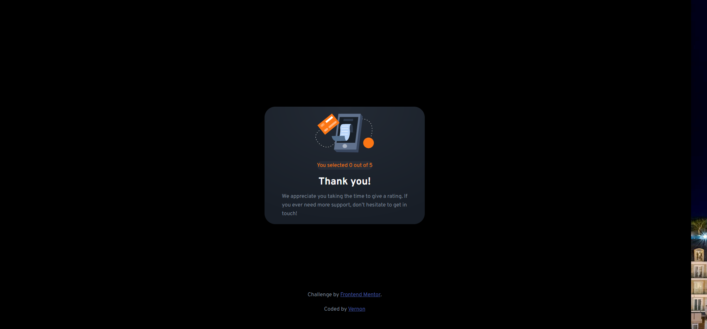

# Frontend Mentor - Interactive rating component solution

This is a solution to the [Interactive rating component challenge on Frontend Mentor](https://www.frontendmentor.io/challenges/interactive-rating-component-koxpeBUmI). Frontend Mentor challenges help you improve your coding skills by building realistic projects.

## Table of contents

- [Overview](#overview)
  - [The challenge](#the-challenge)
  - [Screenshot](#screenshot)
  - [Links](#links)
- [My process](#my-process)
  - [Built with](#built-with)
  - [What I learned](#what-i-learned)
  - [Continued development](#continued-development)
- [Author](#author)

## Overview

### The challenge

Users should be able to:

- View the optimal layout for the app depending on their device's screen size
- See hover states for all interactive elements on the page
- Select and submit a number rating
- See the "Thank you" card state after submitting a rating

### Screenshots

### Links

- Solution URL: (https://github.com/VernonDodo/interactive-rating-component.git)
- Live Site URL: (https://sheltered-brook-05074.herokuapp.com/)

## My process

When I saw two different pages, I immediately decided to set this up as an Express
app with ejs templating, because that just made sense. The components were container-like so that lent itself to using bootstrap components.

I set up the initial page and thank you page as views, with the header and footer as partial views. The submit button on the home page uses the POST method to post to the confirmation page.

### Built with

- Semantic HTML5 markup
- CSS custom properties
- Flexbox
- [NodeJS](https://nodejs.org/en/) - NodeJS library
- [Express](https://expressjs.com/) - Express framework
- [Bootstrap](https://getbootstrap.com/) - For pre-styled components

### What I learned

When it comes to creating different pages, NodeJS with Express routing is the way to go for me. Templating allows one to create headers and footers, keeping your pages looking consistent, with just different views for each page - this helped to cut down time to create two different pages.

### Continued development

Unfortunately, I did not succeed in passing parameters from the home page to the thank you page; that is going to be a continued development goal.

## Author

- Frontend Mentor - [@yourusername](https://www.frontendmentor.io/profile/VernonDodo)
